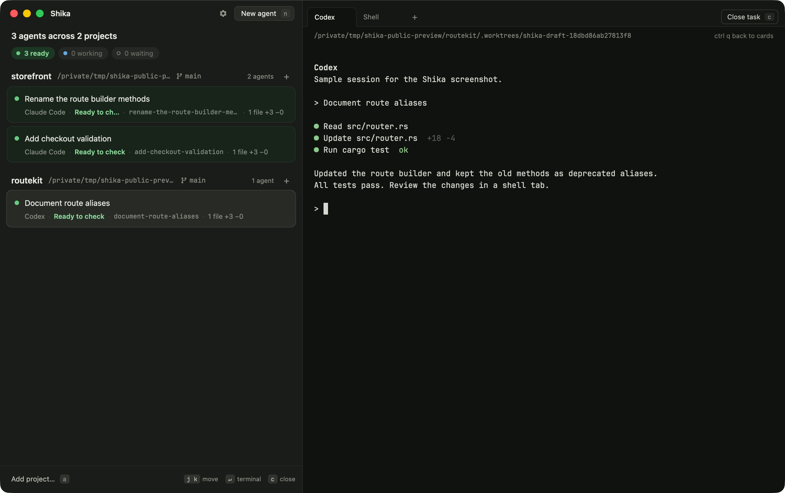

# Shika

A keyboard-first Mac app for running Claude Code, Codex, Cursor CLI, and Pi in separate Git worktrees. Shika creates the worktree and opens the CLI you already use, with your existing login and plan. It does not wrap a model API.

I built Shika to solve the worktree and terminal juggling I run into when working with several coding agents. I use it every day, including to build Shika itself.

[Website and interactive prototype](https://useshika.com) · [Contributing](CONTRIBUTING.md) · [Implementation decisions](PLAN.md)



*Native app screenshot with disposable sample projects and simulated CLI output. The website demo is an interactive prototype.*

## Try it

Shika is early-stage, macOS-only software. Bugs and incomplete workflows are tracked in [MANUAL_CHECKS.md](MANUAL_CHECKS.md); a passing test suite does not establish every GUI check.

[Download Shika.dmg](https://github.com/xuanhieu2611/shika/releases/latest/download/Shika.dmg), open it, and drag Shika to Applications. The download is signed and notarized. It needs an Apple silicon Mac with macOS 13 or later and at least one installed, authenticated supported CLI. Shika does not update itself yet; download each new version from [Releases](https://github.com/xuanhieu2611/shika/releases).

### Build from source

You need macOS 13 or later, Rust, full Xcode (not only Command Line Tools), and at least one installed, authenticated supported CLI. GPUI is pinned in [Cargo.toml](Cargo.toml). Runtime Metal shaders avoid requiring Xcode's separate Metal Toolchain component.

```sh
git clone https://github.com/xuanhieu2611/shika.git
cd shika
source "$HOME/.cargo/env"
./scripts/bundle-app.sh
open target/release/Shika.app
```

Local bundles are ad hoc signed. The app discovers `claude`, `codex`, `agent` (Cursor CLI), and `pi` through your login shell's PATH, including when launched from Finder. Your CLI subscription or provider charges still apply.

## Agent permissions

The current presets launch CLIs in automatic approval modes:

| CLI | Launch arguments |
| --- | --- |
| Claude Code | `--dangerously-skip-permissions` |
| Codex | `--dangerously-bypass-approvals-and-sandbox` |
| Cursor CLI | `--yolo --trust --sandbox disabled` |
| Pi | `--approve` |

Claude Code, Codex, and Cursor CLI bypass permission prompts or sandboxing. Agents can execute commands with your user account's access. A worktree separates Git edits; it does not restrict access to files, credentials, or the network. Use Shika in projects you trust and review the agent's changes.

Shika has no telemetry or model API integration. Your CLIs connect to their providers, Git fetch and push connect to your remotes, and approved setup commands can use the network.

## Workflow

1. Press `a` to add a Git repository, then Cmd+N to pick an agent. Shika creates a fresh branch and worktree under that repository's `.worktrees/`.
2. Write your prompt in the terminal. The first prompt names the task and branch; the CLI's session title can refine it later.
3. Move between cards with `j` / `k`. Enter focuses the terminal; Ctrl+Q returns to cards. Ready means output went quiet or the process exited, so check the terminal for its result.
4. Press Cmd+T to add an independent shell in that task's worktree. Review and test there. Commit/push manually, or use Create PR (Cmd+Shift+P): confirm the files and title, then Shika commits, pushes, and creates a GitHub PR targeting the task's original base. Requires `gh auth login`; never merges. Ctrl+Tab cycles tabs; Cmd+1 selects the pinned agent tab. Cmd+W closes only a shell.
5. Press Cmd+Shift+W to close the task. Close asks before discarding uncommitted work or unpushed commits, and offers push when the tree is clean. A push keeps the card open. Close never commits. A clean idle task closes immediately.

See [Confirmed PR publishing](docs/publishing.md) for behavior, decision rationale, implementation, and troubleshooting.

One terminal is visible at a time; hidden task terminals keep running. Projects persist, live sessions do not restore, and quitting leaves worktrees for explicit cleanup on the next launch. App data lives in `~/Library/Application Support/com.hieule.shika/`.

## Optional worktree preparation

Create `.shika/worktrees.json` in a project's main checkout to prepare fresh worktrees before agents start:

```json
{
  "copy-files": [".env.local"],
  "setup-worktree": ["npm ci"],
  "timeout-seconds": 600
}
```

Use your project's commands. Copied files must already be ignored by Git on both the main checkout and the task's base. Shika asks for local approval and asks again when configuration changes. Setup commands are trusted code, executed with your account's access. See [worktree preparation](docs/worktree-preparation.md) for configuration, progress, cancel, retry, and cleanup rules.

## Development and contributing

Pure Rust on GPUI, with three crates: `shika-core` owns Git, persistence, and processes; `shika-terminal` owns terminal rendering; `shika` owns the app UI. Issues and pull requests are welcome. Start with [CONTRIBUTING.md](CONTRIBUTING.md) for onboarding and feature guides. [PRD.md](PRD.md) records the original scope; [PLAN.md](PLAN.md) records later decisions.

```sh
cargo fmt --all --check
cargo test --workspace --locked
cargo clippy --workspace --all-targets --locked -- -D warnings
./scripts/bundle-app.sh --debug
```

Never run automated UI checks against your normal app data. Use disposable repositories and a fresh directory:

```sh
open -n target/debug/Shika.app --args --data-dir /absolute/path/to/test-data
```

Confirm Shika's own window is in front before sending keystrokes. A `cargo run` launch does not prove Finder PATH discovery. See [terminal checks](crates/shika-terminal/MANUAL_CHECKS.md) and the [acceptance record](MANUAL_CHECKS.md).

## License

Shika is [MIT licensed](LICENSE). Fonts and copied icons retain their upstream licenses; see [third-party notices](THIRD_PARTY_NOTICES.md). Native notices are included in the app bundle.
