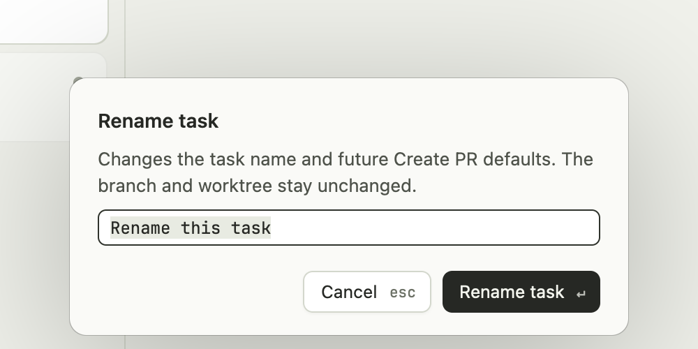

# Renaming a task

**Rename task changes Shika's display name, not the Git branch.** This guide is the user-facing explanation and contributor contract. Automatic branch naming is documented separately in [branch-naming.md](branch-naming.md).

## How to rename

Right-click or Control-click a card and choose **Rename task…**, or select a task and use **Agent > Rename task…** / **Cmd+Shift+R**. The dialog opens with the full current name selected. Type or paste a replacement, then click Rename task or press Enter. Escape or Cancel leaves the name unchanged.

Native dialog capture from the disposable, injected-input test fixture, not real-provider acceptance.

Names can contain Unicode, must be one line, and can have up to 80 characters. Leading and trailing whitespace is trimmed; an empty name is refused. The field supports selection, cursor movement, clipboard shortcuts, grapheme-aware deletion, and native input methods. Pasted line breaks become spaces. Validation errors stay in the dialog.

Renaming is available once the CLI session has started, including while the agent is working or waiting for an answer. It does not stop the agent or reset its elapsed turn. Setup-running and setup-failed cards have no live session to rename, so their menu item is disabled. Busy app operations and other dialogs block entry.

Opening, applying, or cancelling Rename task does not change which card is selected. A context-menu rename targets the clicked card even if a different card was selected. Completion and cancellation restore the opening focus, without typing into a terminal or discarding an unsent draft. Notification clicks may still change selection, but cannot steal the editor's focus; if the opener's terminal is now hidden, restoration uses the selected task's visible terminal instead.

## What changes?

| Item | Effect |
| --- | --- |
| Card title | Changes immediately. |
| Future activity and PR-check notifications | Use the new name. Already-posted notifications are not rewritten. |
| Close dialog title | Uses the new name. Git facts and safe-close checks are unchanged. |
| A future Create PR preview | Prefills the editable commit/PR title with the new name. It still requires confirmation. |
| Later prompt or CLI titles | Cannot overwrite the manual display name. |

## What does not change?

- The Git branch name, commits, index, files, remotes, upstream, or recorded starting base.
- The worktree folder, its journal entry, or which branch Shika owns for Close.
- Existing commit messages or existing PR titles/bodies. Create PR reuses an existing PR without renaming it.
- The agent's own session title or private files. Shika does not send a rename command to the CLI.
- PTYs, shell tabs, agent activity, elapsed time, attention order, or notification routing IDs.

### Does renaming also rename my branch?

No. The Rename task action performs no Git or filesystem operation.

**Automatic branch naming still runs independently.** If you rename a card before its first prompt or before the CLI supplies its one-time title, that later prompt/title can still name the branch under the existing rules. It does not overwrite your card name. For example, naming a card "Investigate login" and then sending "Fix expired tokens" can produce a branch `fix-expired-tokens` with a card still named "Investigate login". A published branch is never automatically renamed.

This separation is intentional: organizing the cards should not unexpectedly change public Git names, shell commands, or PR identity. A manual Rename branch action is not part of this feature.

### Does it change my commit message?

Not on its own. Nothing is committed by Rename task, and shell/agent-created commits are unaffected. The next **Create PR** dialog starts with the new name in its editable title field. If you confirm that flow, the chosen field value is used for any new commit and new PR; you can edit it first. Existing commits and reused PRs remain unchanged. See [publishing.md](publishing.md).

### Can the agent undo my name? Does it survive quitting?

Prompt capture and CLI-title discovery cannot replace a manual name. You can rename again, but there is no reset-to-automatic action.

The name is memory-only, like the live task itself. Shika does not restore sessions after relaunch, so it does not persist these display names or add them to the worktree cleanup journal. Git branch names and worktrees retain their existing lifecycle.

## Contributor implementation map

- `crates/shika-core/src/session.rs`: `Session::manual_title`, `task_title`, `SessionStore::set_title`, and automatic `rename` / `apply_cli_title`. Validation and the override are enforced under the same short metadata lock. Automatic updates may still change the branch, but preserve a manual title.
- `crates/shika-core/src/lib.rs`: `Core::session_set_title` is a metadata-only API. It does not take the long Git operations lock or touch the journal, so it can safely run on the UI thread.
- `crates/shika/src/main.rs`: `RenameTask`, `rename_task`, `apply_task_name`, `Overlay::Rename`, and the card context menu. The dialog binds to the agent view's stable entity ID, not selection or a vector index. Prompt/CLI background completions reread the current core session before applying snapshots, preventing an in-flight old title from undoing a rename.
- `crates/shika/src/name_input.rs`: the native GPUI `EntityInputHandler`, UTF-16/UTF-8 conversion, marked text, cursor/selection, clipboard, and clipped horizontal scrolling. It follows the pinned GPUI input contract; it is not copied from Zed's editor/terminal crates.
- `crates/shika-core/src/publish.rs`: future previews read `Session::title`; confirmation still owns the editable publishing title.

Keep one canonical session title for the card, notifications, Close, and future publishing defaults. Do not implement this as only a UI label, reuse the branch-rename API, set `cli_titled` to suppress branch discovery, or write back to the CLI's private files. Preserve the manual override in every automatic metadata update, and reread current metadata before applying delayed UI snapshots. Task identity and Git ownership must never depend on display text.

Tests cover validation, automatic/manual update ordering, real-Git ownership and journal preservation, independent automatic branch naming, publishing defaults without rewriting existing work, and Unicode editing. [MANUAL_CHECKS.md](../MANUAL_CHECKS.md#manual-task-names) separates native acceptance evidence from tests. Test only with disposable repositories and an isolated `--data-dir`.
